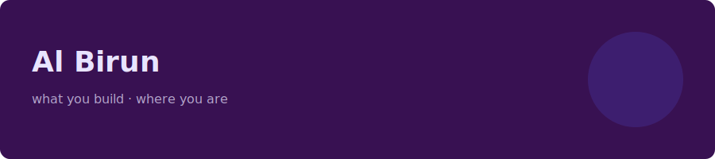

# <!-- SECTION:BANNER -->
<!-- Do not edit here — edit assets/banner.svg -->

<!-- /SECTION:BANNER -->


<!-- SECTION:ABOUT -->
## **About me**

*Student from Chittagong, BD. I'm obsessed with learning new things & making stuff that works perfect and looks amazing. Exploring the path to CSE and AI.<br>Currently learning C, Git, and web technologies.<br>I like understanding how things actually work under the hood. WebDev, GameDev, and OSINT are side quests I plan to tackle, God willing.*


> **I have trust issues with systems that depend on external reliability. Local's the best.**
<!-- /SECTION:ABOUT -->

---

<!-- SECTION:LEARNING -->
## **Currently Learning**

- C — through CS50x
- Python — NumPy, Jupyter
- Linear Algebra — for ML & DS via DeepLearning.AI
- German — *Ja, mein Profil ist sehr nett und klug.*
<!-- /SECTION:LEARNING -->

---

<!-- SECTION:TOOLS -->
## **Tools I Use:**

| Tool             | Level                |
|------            |-------               |
| Obsidian         | ████████████ mastery |
| Jupyter Notebook | ████░░░░░░░░ basics  |
| Excel            | ████░░░░░░░░ basics  |

<!-- TO ADD: copy a table row and paste below the last one -->
<!-- /SECTION:TOOLS -->

---

<!-- SECTION:TECH -->
## **Stack:**


<!-- TO ADD: copy an img tag above, change src and alt -->
<!-- /SECTION:TECH -->

---  

<!-- SECTION:PROJECTS -->
# **Things I'm building**

**[learning-log](LINK)** — logging my professional learning life. nothing complicated.
`C`

<!-- TO ADD: copy the two lines above (bold link + backtick tech), paste below -->
<!-- /SECTION:PROJECTS -->

---

<!-- SECTION:STATS -->
## **stats**


<!-- /SECTION:STATS -->

---

<!-- SECTION:CONTACT -->
## **Find me**

[](DISCORD_URL)
[](YOUTUBE_URL)
[](XTWITTER_URL)
[](FACEBOOK_URL)
[](mailto:rageinmist@gmail.com)
<!-- /SECTION:CONTACT -->

---

<!-- SECTION:ASCII -->
<div align="center">

```
   █████████                        ███                             
  ███░░░░░███                      ░░░                              
 ███     ░░░  █████ ████ ████████  ████   ██████  █████ ████  █████ 
░███         ░░███ ░███ ░░███░░███░░███  ███░░███░░███ ░███  ███░░  
░███          ░███ ░███  ░███ ░░░  ░███ ░███ ░███ ░███ ░███ ░░█████ 
░░███     ███ ░███ ░███  ░███      ░███ ░███ ░███ ░███ ░███  ░░░░███
 ░░█████████  ░░████████ █████     █████░░██████  ░░████████ ██████ 
  ░░░░░░░░░    ░░░░░░░░ ░░░░░     ░░░░░  ░░░░░░    ░░░░░░░░ ░░░░░░  
                                                                    
         [ One day, I'll build a village ]
         student · builder · local-first
```

</div>
<!-- /SECTION:ASCII -->

<!-- ## **Buy me a coffee🥤**
 
[](https://paypal.me/none_yet) 
[](https://patreon.com/none_yet) 

-->